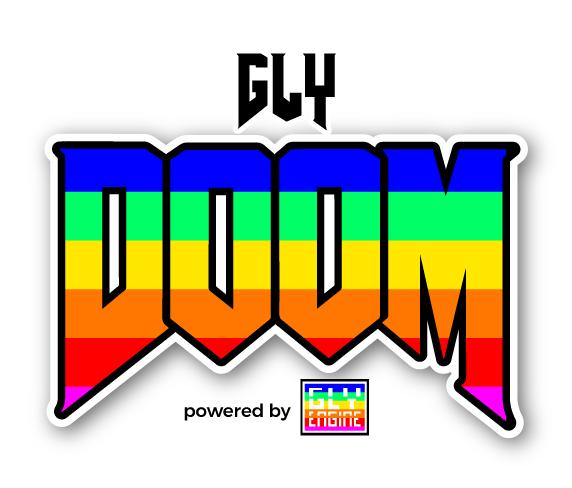

<div align="center">
<h1><a href="https://github.com/gamelly/gly-engine" target="_blank">
</a><br>Gly DOOM<br><sup><br/><sup><sub>made with <a href="https://playground.gamely.com.br" target="_blank">Gly Engine</a></sub></sup></sup></h1>
</div>

### How to Build

#### Easy Mode :nerd_face:

you can use IDE online direct on your browser

- <https://playgrond.gamely.com.br>

#### Call me Terror-Billy! :rage3:

```
npm install
```

```
npm run build
```
